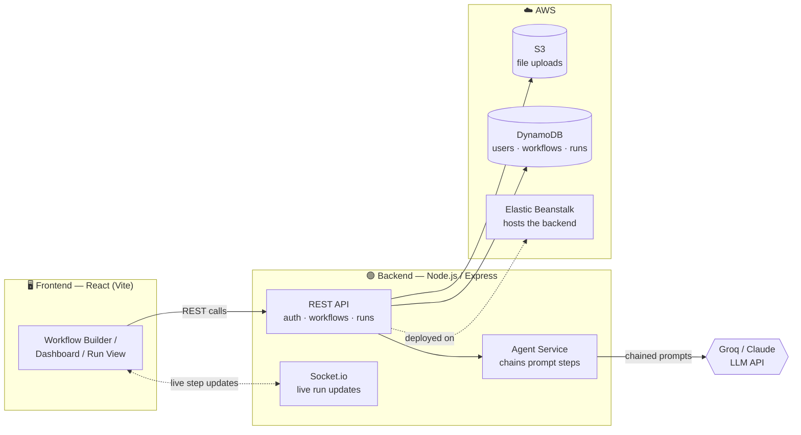
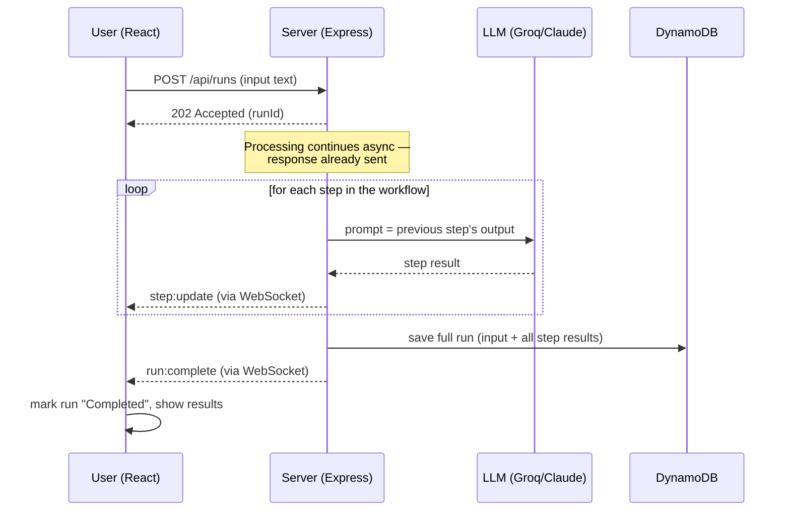

<div align="center">

# ⛓️ Agentic Workflow Automation Tool

**Chain AI agents into pipelines. Watch them run live. Ship it on real AWS infrastructure.**

[](https://react.dev)
[](https://nodejs.org)
[](https://expressjs.com)
[](aws/README.md)
[](backend/src/services/agentService.js)
[](https://socket.io)
[](#license)

</div>

---

A full-stack SaaS platform where users build **chains of AI agent steps** —
summarize → classify → draft a reply, or any custom sequence — and each
step's output automatically feeds the next step's input. Runs execute
live with WebSocket-streamed progress, get persisted to DynamoDB, and
the whole thing deploys to real AWS infrastructure, not just localhost.

## Table of contents

- [Why this exists](#why-this-exists)
- [Features](#features)
- [Architecture](#architecture)
- [How a run executes](#how-a-run-executes)
- [Tech stack](#tech-stack)
- [Quick start](#quick-start-local--no-aws-needed)
- [Project structure](#project-structure)
- [Deploying to AWS](#deploying-to-aws)
- [Screenshots](#screenshots)

## Why this exists

Most portfolio AI projects are a single prompt in a notebook. This one
chains multiple agent steps into a reusable pipeline, tracks execution
live over WebSockets, persists everything to a real cloud database, and
deploys to actual AWS infrastructure — the difference between "I called
an LLM API" and "I built and shipped a product."

## Features

- 🔗 **Chained agent steps** — summarize, extract, classify, draft a
  reply, or write a fully custom instruction; each step consumes the
  previous step's output
- ⚡ **Live execution view** — watch each step complete in real time via
  Socket.io, no polling
- 📋 **Full run history** — every run is saved with its input and every
  step's answer, browsable and expandable after the fact
- 🔐 **JWT auth** — scoped per-user data, nothing shared across accounts
- ☁️ **Real AWS deployment** — S3 for uploads, DynamoDB for data, IAM
  least-privilege policy, Elastic Beanstalk hosting, GitHub Actions CI/CD
- 🌓 **Runs fully local too** — SQLite + disk storage, zero AWS cost to
  develop or demo

## Architecture



## How a run executes



The key idea: **step 2 doesn't see the original input — it sees step
1's output.** That chaining is what makes this "agentic" rather than a
single one-shot LLM call.

## Tech stack

| Layer | Technology |
|---|---|
| Frontend | React (Vite), React Router, Socket.io client, custom dark UI (no component library) |
| Backend | Node.js, Express, JWT auth, Socket.io, Zod validation |
| Database | DynamoDB (single-table design) in production · SQLite (`node:sqlite`, zero native deps) locally |
| File storage | S3 (production) · local disk (development) |
| LLM | Groq (Llama models) or Anthropic Claude — swappable via `agentService.js` |
| Infra | Elastic Beanstalk, IAM, GitHub Actions CI/CD |

## Quick start (local, no AWS needed)

**Backend**
```bash
cd backend
cp .env.example .env
# edit .env: set JWT_SECRET and your LLM API key
npm install
npm run dev
```
Runs on `http://localhost:4000`.

**Frontend**
```bash
cd frontend
npm install
npm run dev
```
Runs on `http://localhost:5173`, calling the backend at `:4000`.

Register an account, create a workflow (e.g. Summarize → Classify),
paste some text, and watch it execute step by step in real time.

> In development the frontend and backend run as two separate servers.
> In production they're served as one — see below.

## Single-URL production build

The backend serves the built frontend directly, so the whole app lives
at one URL — no separate static hosting needed.

```bash
cd frontend
echo "VITE_API_URL=" > .env.production
npm run build
rm -rf ../backend/public
cp -r dist ../backend/public
```

Then deploy `backend` (now including `public/`) the normal way. The
resulting Elastic Beanstalk URL serves the React app at `/` and the API
at `/api/*` from the same origin — that's the single link to share.

## Project structure

```
backend/
├─ src/routes/          auth, workflows, runs
├─ src/services/        agentService (LLM calls), storageService (local/S3)
├─ src/db/               store.js (unified SQLite/DynamoDB layer)
├─ src/middleware/       auth guard, async error handling
├─ src/ws/               Socket.io live run updates
└─ public/               built frontend (generated — see below, gitignored)
frontend/
├─ src/pages/            Auth, Dashboard, WorkflowBuilder, RunView
├─ src/components/       Layout, RunDetailCard
├─ src/context/          auth state
└─ src/theme.css         design tokens (dark control-panel aesthetic)
aws/
├─ dynamodb-table.json, iam-policy.json, README.md   deployment-ready AWS config
.github/workflows/
└─ deploy.yml            CI/CD to Elastic Beanstalk
```

## Deploying to AWS

See [`aws/README.md`](aws/README.md) for the full deployment guide —
S3, DynamoDB, Elastic Beanstalk, IAM, and CI/CD, console-only steps
included.

**🔗 Live demo:** [agentic-workflow-automation-env.eba-meeezaxf.eu-north-1.elasticbeanstalk.com](http://agentic-workflow-automation-env.eba-meeezaxf.eu-north-1.elasticbeanstalk.com)

## Screenshots

<!-- Add screenshots or a demo GIF here — dashboard, workflow builder, and live execution view work best -->

| Dashboard | Workflow Builder | Live Execution |
|---|---|---|
|  | _screenshot_ | _screenshot_ |

## Notes

- Local mode uses SQLite (Node's built-in `node:sqlite`) + disk storage —
  zero AWS cost and zero native compilation to develop or demo.
- The SQLite schema is deliberately shaped to map 1:1 onto the DynamoDB
  single-table design, so the storage layer swap is contained to one
  file (`db/store.js`) rather than spread across route logic.
- Every async route is wrapped to catch unhandled errors — a single bad
  request returns a clean 500 instead of crashing the whole server.

## License

MIT